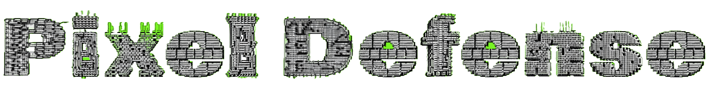

# Pixel Defense

**Pixel Defense** is a generic pixel-styled tower defense game (TD) made in C++ using SFML.
## UML Class Diagram

## Authors

- [@Jesper-R](https://github.com/Jesper-R)

## License

